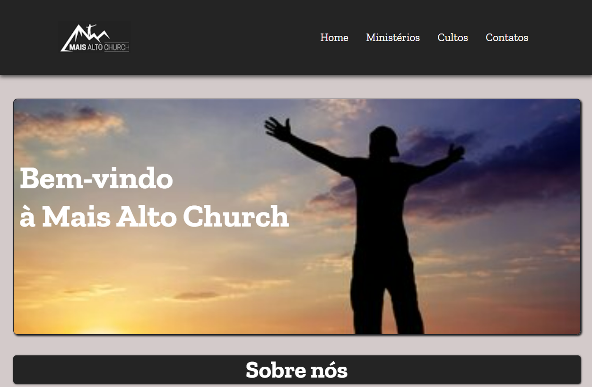
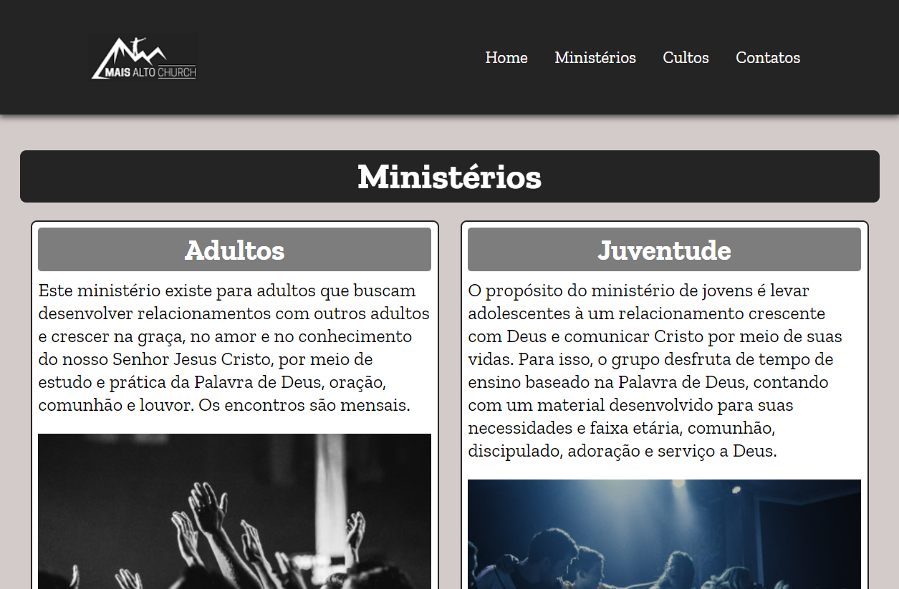
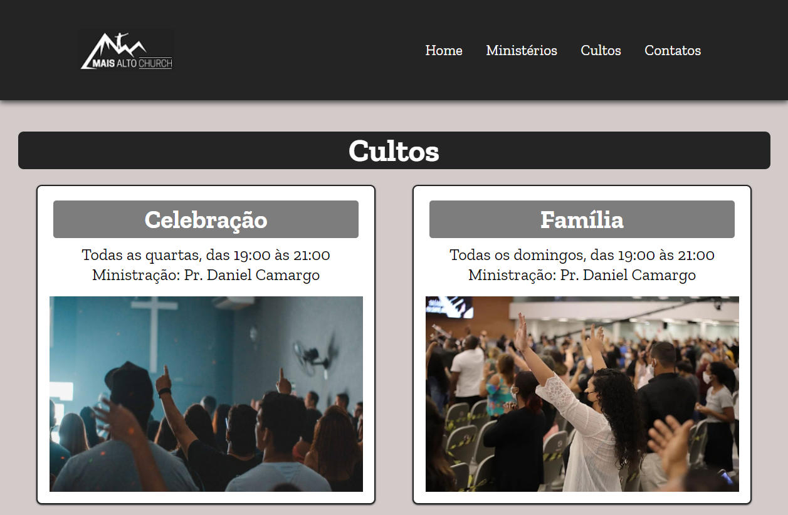
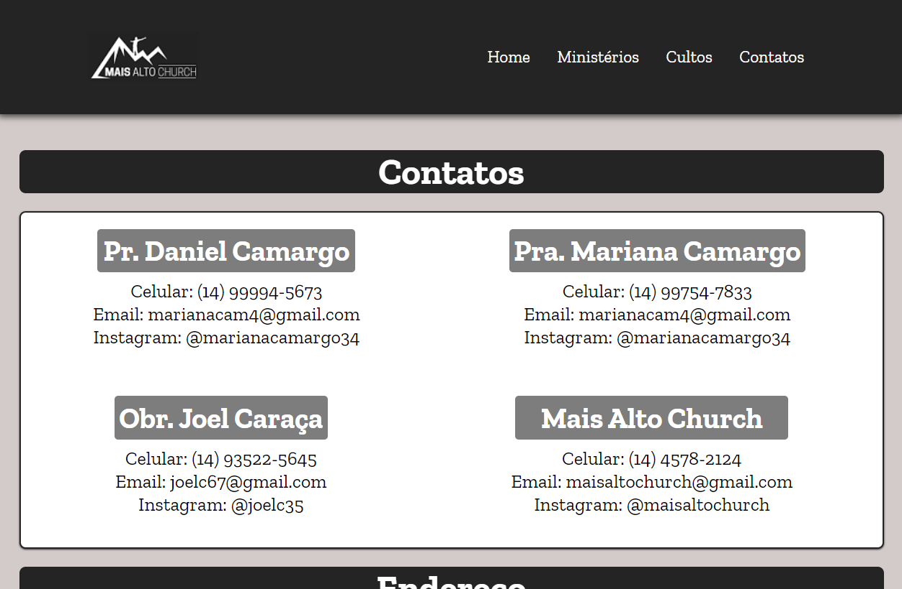

# Mais Alto Church

Bem-vindo ao site oficial da Mais Alto Church!

## Páginas do Site

- [Home](#home)
- [Ministérios](#ministérios)
- [Cultos](#cultos)
- [Contatos](#contatos)

## Home

A Home apresenta informações sobre a história, a visão e os valores da Mais Alto Church. Destacamos nossos fundadores, nossa missão de fazer discípulos e nossa visão de ser uma igreja transformadora na sociedade.

## Ministérios

Nossa igreja oferece diversos ministérios para atender às necessidades espirituais e sociais da comunidade. Nesta página, você encontrará uma descrição de cada ministério, detalhando suas atividades, horários de encontros e formas de participação.

## Cultos

A página de cultos é o espaço onde você encontrará informações detalhadas sobre os horários, formatos e estilos de culto oferecidos pela Mais Alto Church. Nesta página, você poderá conhecer os diferentes tipos de culto, como cultos de adoração, estudos bíblicos, encontros de oração e outros eventos especiais.

## Contatos

Entre em contato conosco! Nesta página, você encontrará informações para se comunicar conosco, como endereço, telefone, e-mail e links para nossas redes sociais. Fique à vontade para nos enviar uma mensagem ou visitar-nos pessoalmente.

## Contribuição
Se você quiser contribuir para o desenvolvimento do site da Mais Alto Church, fique à vontade para abrir um pull request. Agradecemos suas sugestões e melhorias!

## Contato
- Email: maisaltochurch@gmail.com
- Website: https://jpabloslino.github.io/maisaltochurch/
- Siga-nos nas redes sociais: [Facebook](https://www.facebook.com/maisaltochurch) | [Instagram](https://www.instagram.com/maisaltochurch) | [Youtube](https://www.youtube.com/@MaisAltoChurch)
